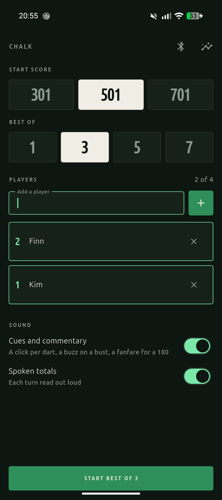
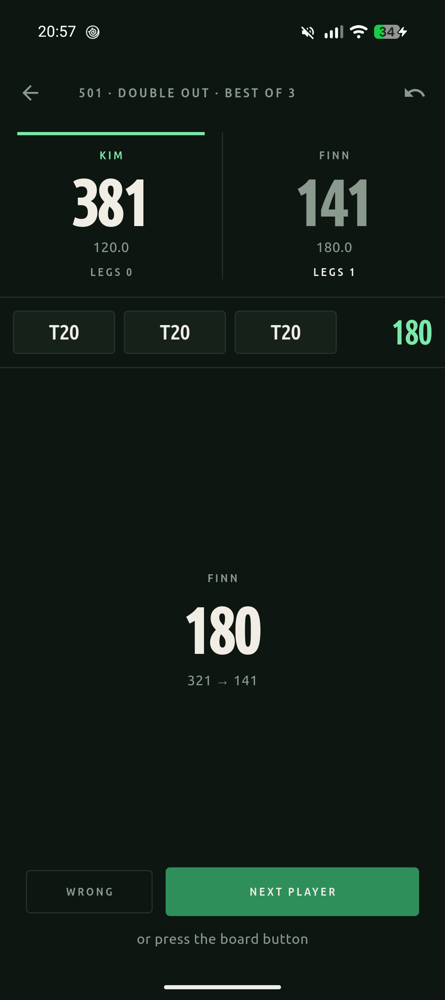
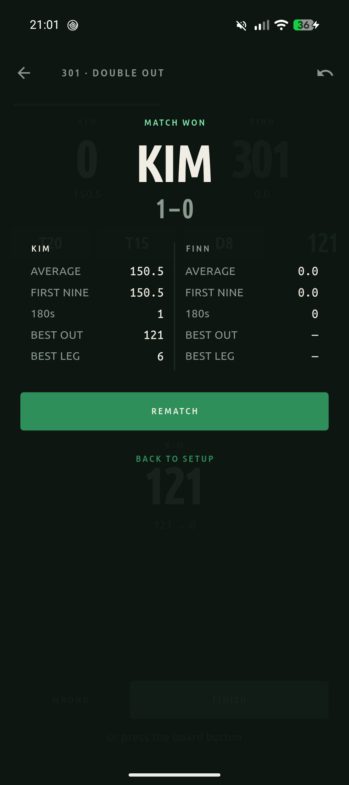
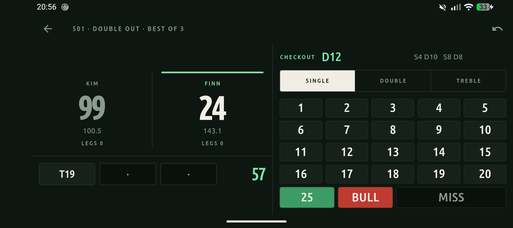

<div align="center">

# Chalk

**A darts scorer for the GranBoard 132, in the shape of the board rather than the shape of a form.**

[](https://flutter.dev)
[](https://dart.dev)
[](#)
[](#testing)
[](docs/DATA_MODEL.md)

x01 for up to four players, best of 1/3/5/7, live checkout suggestions, spoken
commentary rendered at build time, and per-player statistics across every dart
ever thrown — with the board connected over Bluetooth, or with nothing but the
keypad.

</div>

---

<div align="center">







</div>

---

## What it does

| | |
|---|---|
| **x01** | 301 / 501 / 701, straight in, double out, two to four players |
| **Matches** | Best of 1, 3, 5 or 7. The throw rotates every leg, because throwing first is a real advantage |
| **Checkouts** | Every route from 170 down, live, with the suggested keys outlined on the keypad |
| **Board** | GranBoard 132 over BLE, with a calibration screen for the segments no public source has ever verified |
| **Sound** | A cue per dart and every three-dart total spoken aloud — 186 lines rendered offline at build time, no TTS engine on the phone |
| **Statistics** | Three-dart average, first nine, 180s, best checkout, best leg, checkout rate, and a heatmap of where the darts landed |
| **Layout** | One column on a phone, scoreboard beside keypad on a tablet or a phone on its side |

Everything is stored as **the darts that were thrown**, never as a running
total. Undo is folding a shorter list; there is nothing to retract.

## Quick start

```bash
flutter pub get
dart run build_runner build --delete-conflicting-outputs   # drift codegen
flutter run
```

No board required — the app starts on a **simulated** source. Switch it to
Bluetooth from **Board diagnostics** on the setup screen when you have hardware
in front of you.

## How it is put together

```
lib/
├── domain/     pure Dart, no Flutter — the x01 fold, the checkout search,
│               the match fold, the statistics
├── data/       the board protocol and the drift database
└── app/        Riverpod providers, screens, widgets, audio
```

The one rule enforced mechanically: **`lib/domain/` must not import
`package:flutter`**. `test/domain/domain_purity_test.dart` fails if it ever
does. The engine is the part worth testing hardest, so it is kept somewhere a
widget cannot reach.

State is a fold, top to bottom:

```
darts thrown ──foldLeg──▶ LegState ──foldMatch──▶ MatchState
                             │                        │
                             └─ checkout routes       └─ legs won, match winner
```

Nothing is counted incrementally at either level. That is what makes undoing
the checkout that won a leg — or won the match — put everything back with no
bookkeeping.

Full detail: **[docs/ARCHITECTURE.md](docs/ARCHITECTURE.md)**.

## Documentation

| Document | What is in it |
|---|---|
| [ARCHITECTURE.md](docs/ARCHITECTURE.md) | Layers, the folds, the provider graph, audio, responsive layout |
| [HARDWARE.md](docs/HARDWARE.md) | What the GranBoard 132 is, its sensor matrix, the segment table, and what is verified versus assumed |
| [CONNECTIVITY.md](docs/CONNECTIVITY.md) | GATT service, scanning and Android's throttle, reconnect backoff, permissions, playing without a board |
| [BOARD_PROTOCOL.md](docs/BOARD_PROTOCOL.md) | Frame format, the greeting, dedupe, calibration, hardware day |
| [DATA_MODEL.md](docs/DATA_MODEL.md) | Every table, schema v1 → v3, and what the migrations do and deliberately do not do |
| [DEVELOPMENT.md](docs/DEVELOPMENT.md) | Commands, codegen, the asset generators, dependency constraints, test layout |
| [PLAN.md](docs/PLAN.md) | The original design and milestones |
| [ROADMAP.md](docs/ROADMAP.md) | The five features that took it from working scorer to something you would choose to use |

## Testing

```bash
flutter test                      # everything, 292 tests
dart test test/domain test/data   # engine, checkout and protocol — no Flutter needed
flutter analyze
```

`test/domain` and `test/data` run under plain `dart test` because neither layer
imports Flutter. `test/app` needs `flutter test`.

What the suite pins:

- the x01 rules, including bust, double-out and the darts left in a turn
- every checkout route from 170 down, and the bogey numbers that have none
- the match fold, the win threshold, and the leg-by-leg rotation of the throw
- frame assembly: split frames, glued frames, duplicates inside 50 ms, the greeting
- the v2 → v3 migration, with rows already in the table
- the exact mapping from a game-state transition to a sound
- the layout at phone portrait, phone landscape and tablet sizes

## Generated assets

Three committed Python scripts produce everything that would otherwise be a
binary somebody has to redraw:

| Script | Produces |
|---|---|
| `tool/make_icon.py` | The launcher icon, Android and iOS, from `Palette.ground` and `Palette.chalk` — so the icon cannot drift from the theme |
| `tool/make_speech.py` | 186 spoken lines via Piper, encoded to Ogg. The 63 MB voice model is build-time only and is never shipped |
| `tool/make_cues.py` | The four cues, synthesised from sine partials with Python's `wave` module |

See [DEVELOPMENT.md](docs/DEVELOPMENT.md#generated-assets) for how to re-run them.

## Licence notes

- **`flutter_blue_plus` is not open source.** Free for personal use; any
  for-profit use needs a purchased commercial licence. Shipping this
  commercially means swapping it for `flutter_blue_ultra` or `universal_ble`
  (both BSD-3).
- The Piper voice output is **CC BY-SA 4.0**; the attribution lives beside the
  audio in `assets/sounds/SPEECH-VOICE-LICENCE.txt`.
